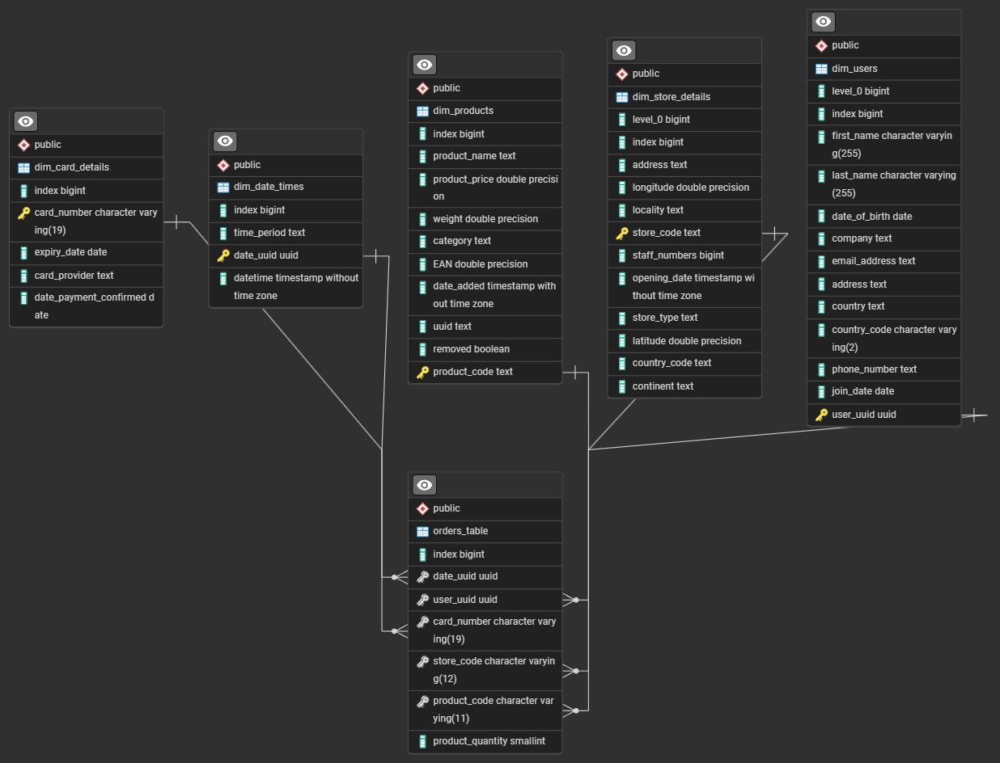

# Multinational Retail Data Centralisation

The purpose of this repository is to do the following:

1. Extract and clean the current data
2. Create the database schema
3. Query the data

In more detail:

We have datasets for a business that sells products in stores across different countries. They want to have their data centralised into one location.

Therefore, the data needs to be cleaned so that it is ready to be uploaded to the centralised database. Then, they want to use this new database to get metrics from the data.

## Table of Contents

- [Multinational Retail Data Centralisation](#multinational-retail-data-centralisation)
  - [Table of Contents](#table-of-contents)
  - [Project Structure](#project-structure)
  - [Extracting and cleaning data](#extracting-and-cleaning-data)
    - [Sources](#sources)
    - [Methodology](#methodology)
    - [Installation instructions](#installation-instructions)
      - [Python](#python)
      - [Postgresql](#postgresql)
      - [URLs for API, S3 Buckets, etc.](#urls-for-api-s3-buckets-etc)
    - [Usage instructions](#usage-instructions)
  - [Modifying database schema](#modifying-database-schema)
  - [Querying the data](#querying-the-data)
  - [ERD Diagram](#erd-diagram)
  - [Reflection on Project](#reflection-on-project)
  - [License](#license)

## Project Structure

- This repository is for Milestone 1.
- `main.py` and other Python files are for Milestone 2.
- `db_schema` folder contains SQL queries for Milestone 3.
- `db_queries` folder contains SQL queries for Milestone 4.

## Extracting and cleaning data

### Sources

The data comes from different sources. These include:

- AWS RDS Postgresql database
- Tables embedded in a PDF document
- AWS API for JSON data
- AWS S3 Bucket files (CSV, JSON)

### Methodology

There are three main classes to this program:

- **DatabaseConnector**: acts as a connection to a Postgresql database, allowing read/write of tables.
- **DataExtractor**: contains methods for extracting data from the sources, and returning pandas DataFrame objects.
- **DataCleaning**: contains methods to clean and format the data from DataExtractor so that it is ready to be uploaded to a local database.

Additionally, there is an `interactive.ipynb` notebook which demonstrates the process of interacting with the datasets to determine what functions were required to clean the data. This meant testing the results were much easier as the code could be executed step by step, and checking the results.

### Installation instructions

#### Python

1. Ensure Python and Conda are installed.
2. Install the `conda` environment with `conda env create -f environment.yml`.
3. Activate the environment with `conda activate multinational-retail-data-centralisation874`

#### Postgresql

1. Ensure you have a local Postgresql installation running.
2. Create a file called `local_db_creds.yaml`. Populate it with the following:

    ```yaml
    RDS_HOST: <host>
    RDS_USER: <username>
    RDS_PASSWORD: <password>
    RDS_DATABASE: <db to store data>
    RDS_PORT: <port>
    ```

    For example

    ```yaml
    RDS_HOST: localhost
    RDS_PASSWORD: 'my-very-strong-password'
    RDS_USER: postgres
    RDS_DATABASE: sales_data
    RDS_PORT: 5432
    ```
3. Repeat the above for a file called `db_creds.yaml`. This should contain the remote database details.

#### URLs for API, S3 Buckets, etc.

- For the API credentials, see `api_creds.example.yml`. Make a copy and rename it to `api_creds.yml`. Then fill in the details.
- For S3 buckets, do the following:
    - For the Product data, create a text file called `product_bucket_url.txt` and paste the S3 URL for that file.
    - For the Date events data, create a text file called `date_bucket_url.txt` and paste the S3 URL for that file.
- For the PDF file, create a text file called `pdf_url.txt` and paste the URL for the file.

### Usage instructions

1. Open a terminal in the current working directory, and ensure Conda is activated.
2. Run `main.py` with the following: `python main.py`
3. This will run through fetching, cleaning, and uploading each data source to the local database instance.
4. The time for each step will be output into the console.

**Note**: Some of these operations can take a long time due to rate limits or large data sets.

## Modifying database schema

In the `db_schema` folder are SQL statements for updating and altering the database schema to match the required specification.

Since I had used Pandas to convert the datatypes to their correct representation, most of the modifications to the schema were to change columns to the datatypes that Pandas did not provide. For example, changing a string type to a UUID type.

At the stage of creating constraints on the orders table to the keys in the other tables, I was able to discover additional data that was incorrectly parsed by myself, such as certain values becoming null when they should not be. I had to revisit my cleaning code and use the notebook to confirm where my errors were and correct them.

## Querying the data

In the `db_queries` folder are SQL statements for querying the finalized database to answer specific questions.

## ERD Diagram

Once the relationships are defined, the database represents a Star Schema.



## Reflection on Project

From working on this project, I have been able to develop skills in handling different data sources, and parsing them into usable data. The project gave me the opportunity to try out AWS features, and while I was only retrieving data from AWS services like S3, I was still able to setup my own and use Python to retrieve data from it.

Using different libraries, I have been able to fetch the data, parse it into Pandas DataFrames, and then perform methods on the data to remove erroneous values and ensure that the data is suitable to be used in the database. Using a Jupyter Notebook, I could perform cleaning on the data step-by-step, to ensure that the functions I was applying were getting the results I wanted. This made it far easier to collate these functions into one method, rather than having to re-run the entire code when making changes, and fetching the data all over again.

There have definitely been some challenges, where I needed to reiterate over the data numerous times to find values that were not suitable for the column, and in some cases only discovering these once I began to try sending the data to the database, and updating the schema. It goes to show why consistency across data is important both virtually and physically.

Unfortunately, I was not able to get phone number parsing working as correctly as I had hoped, the dataset contained so many different formats for the numbers that even with the assistance of the `phonenumbers` library I was still getting parsing issues. I created a method that firstly removes unnecessary characters from the number, and then takes the user's region to attempt to parse their number with the format of that locale. In the end, this didn't entirely matter, as the schema specification wanted the numbers stored as a string instead of an integer.

I was however, able to overcome a similar challenge with the different date formats across the datasets, by attempting multiple approaches to parsing the data, only returning a null value after all attempts failed. This meant I was able to parse the formats into one consistent date style so I could them perform operations on this data.

Furthermore, I have been able to setup my own Postgresql instance and use it for performing SQL queries and updates, both for ensuring the schema is correct to the specification, and retrieving metrics for the questions about the data. Using pgAdmin I could inspect the database schema and use its query builder as a playground to find the data I wanted, and build SQL statements to answer questions on the data.

## License

MIT License. See `LICENSE` for information.